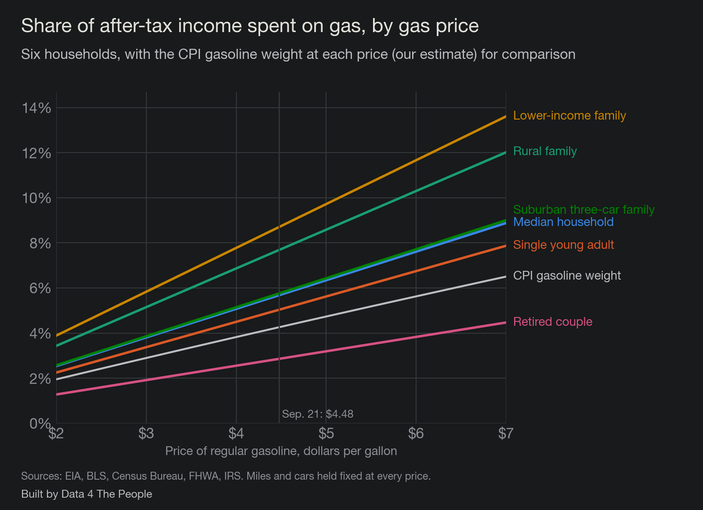
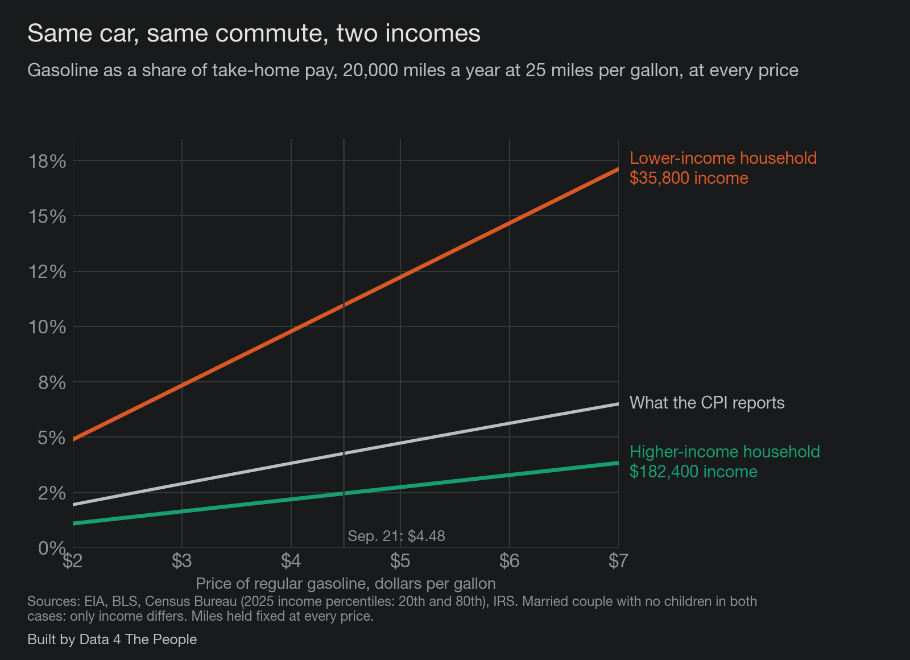

# We measure inflation for one person. You are not that person.

Last month the Bureau of Labor Statistics (BLS) told us that annual inflation was 3.4%.

If you go back over the entire history of CPI (back to 1913), the average annual inflation was 3.3%.

In other words, the struggle with prices you are feeling right now is, as measured by our government, what the typical American has felt over the entire recorded history of this country. It is no big deal. Your experience, if different, is not valid.

How does it feel to be told by the government that your experience of prices as you go about your day is wrong?

This is the problem. Something is not adding up here. The economic machinery of this country seems to be driven by a number that doesn't see the lives of a typical American. And CPI is just one example of this dynamic, of the structures and systems in power becoming tone deaf to the struggles of real people. Maybe this is why America is where it is now. People aren't feeling heard. What if fixing this destructive polarization started with finally seeing and hearing people, and the lives they have to live?

We're not going to fix this today. That's well beyond our pay grade. But we are going to show you why it needs to be fixed for the way we measure inflation. And then we are going to show you how it can be fixed. In short, we are going to give our elected leaders the playbook for how to better measure the lived experience of the people they were elected to serve (that would be voters, not investors).

## Illustrating the problem: we're still using a tape deck when we could stream

1978. That was the year the modern infrastructure was rolled out, introducing the same item and outlet sample design we use today. One year later, Sony released the Walkman, popularizing personal cassette tapes.

What do these two completely unrelated events have in common?

Well, think of what has happened since for music. Tapes were displaced by CDs, which were then displaced by MP3s (and Napster), which were then displaced by iPods. And then the entire music industry was turned upside down by streaming. Unless you are an audiophile and love your records, technology begot progress, and now we carry around the entire history of all music in our pockets on demand for $10 a month.

Now, let's compare this to the enhancements to CPI over the same years. The BLS improved the surveys, introduced chained CPI, started using a geometric mean, and increased the frequency of weight changes. But the 1978 architecture remains the same.

Here are both tracks since 1978, the year the CPI's current design was put in place.

*Music dates are the year each format arrived for American listeners. CPI dates are when each change took effect.*

And that's the problem. One highly competitive industry was literally destroyed and rebuilt from the ground up by technology. The other (our government's inflation measure) is a monopoly, with no competitive forces present to force innovation. And so, it improved a bit here and there. But it remains largely stuck in the 1970s. But look at the bright side, at least CPI is better off than our poverty measure, which was developed and stuck in the 1960s.

Either way, imagine a world where cassette tapes (and music) had the same lack of competitive forces that CPI has. We would still all have Sony Walkmans. Maybe they would be smaller and have slightly better sound quality. But we'd be stuck in the past with our cassette tapes rather than all the music the world has to offer at our fingertips.

## How we can fix this

The reason why inflation is broken is not because CPI is broken. Think of CPI as one "person" out of 330 million. It is based on a set of weights, shares of wallet, that this "person" pays for stuff. It just so happens that in July 2026, CPI spent 3.8% of its money on gasoline, and 2.6% of its money on auto insurance, and 1.0% of its money on airfares. Cool. That's CPI's experience, and I am willing to bet that it does not jibe with lots of people's experience out there.

And here's the deal. With late 1970s technology, that was the best we could do. We could put together an inordinately complex methodology to measure the experience of this one "person" as best as we could. And then we used that to set monetary policy and tell people what inflation was.

A lot has changed since then regarding technology. For example, the tool I have built and am sharing with you was built in minutes by AI, a day if you include all my reviews, stress testing, and writing of the post you are reading. We don't have to have one view of inflation anymore. We can have hundreds, thousands, or even millions of experiences of inflation. We could create an immense distribution curve of inflation as experienced by people up and down the economic spectrum and try to manage the distribution. We don't have to be beholden to error-prone single point estimates anymore (the statistical equivalent of a tape deck). We can do much better.

That distribution already exists in the data. Here is what one month of gasoline looks like when you stop averaging it into a single household.

*The poorest tenth reports spending well above its income, which is a known limit of the survey, so read that point as a direction and not a precise level.*

The CPI reports 4.3%. The poorest tenth of households is at 16.4% and the richest tenth is at 1.9%. One number is standing in for all of that.

## Why we need to fix this: a case study using gasoline prices

Gasoline is the fairest test we could give the CPI, because it is the one thing in the basket the BLS measures almost perfectly.

Since June 2021, no government employee has stood at a pump writing down prices. The gasoline index is built from about 6.1 million price observations a month, gathered from roughly 91,272 stations a day, taxes included. Compare that with the rest of the index. In 2025, the BLS got a rent from fewer than half of the housing units in its sample, and housing is more than a third of the CPI. Whatever is wrong with the gasoline number, it is not the price.

So what does the CPI say gasoline costs? In July 2026, the most recent weight published, gasoline was 3.8% of consumer spending. At the price in the week of September 21, 2026, a national average of $4.48 a gallon for regular, that weight works out to about 4.3%. Call it four and a third cents of every dollar spent.

Here is what that number actually is. The BLS adds up all the gasoline bought by urban consumers and divides it by everything those consumers bought. Households with no car are in the denominator. So is a retired couple who drives to church on Sunday, and so is a contractor who puts 30,000 miles on a pickup. One number comes out the other end, and it belongs to nobody.

So we built the people back in.

We took six households that the government's own data says exist. The Census Bureau gave us their incomes. The Federal Highway Administration's travel survey gave us how far each one drives and the gas mileage of the cars they own. The IRS rules gave us their federal income and payroll taxes, because people buy gas with take-home pay, not with pre-tax pay. Then we did the only arithmetic that matters to a household: gallons burned, times the price, divided by what they actually take home.

The gap shows up immediately. Every household that drives a normal amount spends more of its income on gas than the CPI's 4.3%, and the households that are furthest from that number are the ones with the least room to absorb it.

*At $4.48 a gallon. After-tax income counts federal income and payroll taxes only.*

The median American household, a married couple with two cars and $87,460 of income before tax, spends $4,240 a year on gasoline. That is $353 a month, and it is 5.7% of what they take home. A family at the 20th percentile of income, $35,800 before tax, spends less on gas in dollars, $3,726, but that is 8.7% of their take-home pay. A rural family with a car and a pickup is at 7.7%. A retired couple with one car is at 2.9%, below the CPI's number, which is its own kind of finding.

Try it yourself. The tool below has those six households and a slider for the price, and you can put in your own miles, mileage and income. Nothing you type leaves your browser.

<iframe src="https://data4thepeople.github.io/GasolineCost/embed.html" width="100%" height="780" frameborder="0" scrolling="no" title="What gas really costs a household"></iframe>

Now the part that the single number hides completely.

A share is a snapshot. What matters when prices move is the slope: how fast your share climbs when the price at the pump climbs. Drag the price slider in the tool and watch the lines pull apart. That spread is the whole argument of this post in one picture.

*Miles and cars held fixed at every price, so the lines show price alone.*

Every dollar added at the pump costs the lower-income family 1.9% more of their take-home pay. For the rural family it is 1.7%. For the median household it is 1.3%. In the CPI, a dollar adds about 0.9%. For the retired couple it is 0.6%.

That is one price at one pump on one day, landing anywhere from 0.6% to 1.9% of a paycheck depending on who is filling the tank. And it comes from simple arithmetic: gallons burned divided by take-home pay. Drive more, drive a thirstier vehicle, or earn less, and the slope steepens.

Income is the part people underestimate. The same driving, the same car, the same commute costs the same dollars no matter who you are. What changes is the share of a paycheck it takes, and how steeply that share climbs when the price moves.

*Married couple with no children in both cases, 20,000 miles a year at 25 miles per gallon. Only income differs.*

Two households drive exactly the same way. One earns $35,800 before tax, the other $182,400. At $4.48 a gallon, gas is 11.0% of take-home pay for the first and 2.5% for the second. The CPI reports 4.3%.

Now watch the slopes. Every dollar at the pump adds 2.4 points to the lower-income household's share and 0.6 points to the higher-income household's. The CPI's line rises about 0.9 points. Between $3 and $6 gas, the first household goes from 7.3% of its pay to 14.7%, while the second moves from 1.6% to 3.3%. The same price increase is a different event depending on the size of the paycheck it lands on, and the CPI's single line runs down the middle of all of it.

You might reasonably ask whether these households are made up. They are built from published averages, so we checked them against what people told the government they actually spent.

*From the Consumer Expenditure Survey, the last year the BLS published income after taxes. Means per consumer unit.*

In 2023, the lowest fifth of households by income spent 8.2% of their after-tax income on gasoline and the top fifth spent 1.9%. Move those to today's price and the range runs from about 10.4% down to 2.4%. Our six households sit inside that range, which is the check we wanted.

So here is where the case study lands, in our view. The CPI's gasoline number is not wrong. It is a correct answer to a question almost nobody is asking, which is what gasoline costs the average of all of us at once. The questions people actually ask are what gas costs their household, and what happens to them when the price jumps. The data to answer those questions already exists, and it is public. The only thing missing is the will to publish inflation as a distribution instead of a single point.

[Eric's closing goes here.]

::: divider

## How we built this

Every number above is recomputed from published data each time we rebuild the page.

- **Gas price.** Energy Information Administration weekly U.S. average for regular, all formulations, $4.478 in the week of September 21, 2026. The slider covers $2 to $7.
- **The CPI comparison.** The BLS published gasoline at 3.77% of consumer spending for July 2026. We carry that to any pump price with the same method the BLS uses between weight updates, holding the rest of the basket at its August 2026 level. At $4.48 that gives 4.3%.
- **Incomes.** Census Bureau, income year 2025, released September 15, 2026. Median household $87,460 before tax. Households outside metro areas $68,670. Households headed by someone 65 or older $59,680. Family households $112,900. The 20th percentile of all households $35,800.
- **Miles and mileage.** The 2022 National Household Travel Survey for how far households drive by number of vehicles, where they live and their age, scaled so the totals match the Federal Highway Administration's count of miles driven. Fuel economy from Highway Statistics 2024: 23.4 miles per gallon across all light vehicles on the road, 25.6 for cars, 18.5 for pickups and large SUVs.
- **Taxes.** Federal income tax under the 2026 brackets with the standard deduction, the child tax credit and the earned income credit, plus Social Security and Medicare payroll taxes. Our figure for the median household, $74,634, lands within 2% of the Census Bureau's own measured post-tax median of $76,060.

## What this does not tell you

- **We count federal taxes only.** Most states take income tax as well, which would lower take-home pay and raise every share above. So these figures are conservative.
- **The six households are constructions, not real families.** Each input is a published average for a real group, but no single family matches all of them at once.
- **Miles driven come from a survey with known problems.** About 3% of the vehicles in the 2022 travel survey report impossible mileage, which we drop, and the survey's totals fall short of the Federal Highway Administration's count, which is why we scale to the latter.
- **Nobody drives the same at $7 as at $2.** Our lines hold miles fixed at every price, so the far right of the price chart is likely a little steep for every household, including the CPI's own line.
- **Gasoline is not the whole story.** A household that spends less on gas may spend more on rent, insurance or medical care, and this post measures one item.
- **October 2025 has no CPI.** The federal shutdown stopped collection for 43 days, and that month was never published. It is the first gap since January 1921.
